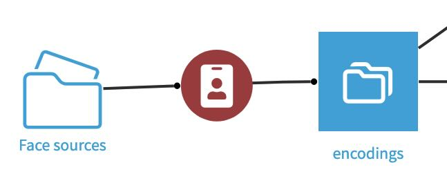
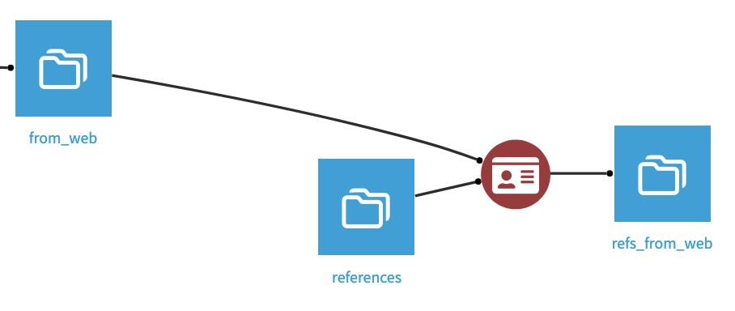

# Face Recognition Plugin for Dataiku DSS

## Overview
The Face Recognition Plugin for Dataiku DSS provides tools to automate the process of face recognition within your data workflows. This plugin includes two main recipes:

1. **Face Encoding Recipe**: Converts a managed folder containing images or a dataset containing URLs toward images into face encodings. Encodings are a 128 floats vectors, and one encoding is produced for each face present in the source pictures.
2. **Reference Dataset Builder Recipe**: Builds a reference dataset containing one grouping GUID for every matching face encoding.

## Installation
To install the Face Recognition Plugin, follow these steps:

1. Make sure cmake is installed on your DSS instance. On a Mac, run `brew install cmake` in a terminal. More details on the necessary installation steps [here](https://github.com/ageitgey/face_recognition?tab=readme-ov-file#installation-options).
2. On Dataiku DSS, go to **App** > **Plugins** > **Add Plugin** > **Fetch from Git repository** > set `git@github.com:alexbourret/dss-plugin-face-recognition.git` in repository URL
3. Follow the installation prompts to complete the setup.

## Recipes

### Face Encoding Recipe
The Face Encoding Recipe transforms images into face encodings. This recipe can process:
- A managed folder containing images.
- A dataset containing URLs toward images.

#### Inputs
- **Managed Folder**: A folder containing image files.
- **Dataset with URLs**: A dataset where each row contains a URL pointing 
to an image.

#### Outputs
- **Face Encodings Dataset**: A dataset containing the face encodings 
extracted from the input images.

#### Configuration
- **URLs column**: If the recipe's input is a dataset, specify the name of the column containing the URLs towards the images containing the faces to encode.

### Reference Dataset Builder Recipe
The Reference Dataset Builder Recipe creates a reference dataset 
containing one grouping GUID for every matching encoding (faces). This 
recipe helps in identifying and grouping similar faces.

#### Inputs
- **Face Encodings Dataset**: The output from the Face Encoding Recipe or 
any dataset containing face encodings.

#### Outputs
- **Reference Dataset**: A dataset with a unique grouping GUID for each 
set of matching face encodings.

#### Configuration
- **Uknown encodings column**: Select the column containing the encodings in the dataset of faces not yet referenced
- **Known encodings column**: Select the column containing the encodings in the dataset of already referenced faces
- **Known references column**: Select the column containing the reference GUID

## Usage

### Step-by-Step Guide

1. **Create a Managed Folder or Dataset**:
   - Upload images to a managed folder in Dataiku DSS.
   - Alternatively, create a dataset containing URLs toward images.

2. **Run the Face Encoding Recipe**:
   - Create a new recipe and select "Face Encoding Recipe".
   - Configure the input (managed folder or dataset with URLs) and output 
(face encodings dataset).
   - Run the recipe to generate face encodings.

3. **Build the Reference Dataset**:
   - Create a new recipe and select "Reference Dataset Builder Recipe".
   - Configure the input (face encodings dataset) and output (reference 
dataset).
   - Run the recipe to build the reference dataset with grouping GUIDs.

## Example Workflow

1. **Upload Images**: Upload a set of images to a managed folder in 
Dataiku DSS.
2. **Encode Faces**: Use the Face Encoding Recipe to convert these images 
into face encodings.
3. **Build Reference Dataset**: Use the Reference Dataset Builder Recipe 
to create a reference dataset with grouping GUIDs for matching faces.

## License

This plugin is distributed under the Apache License version 2.0